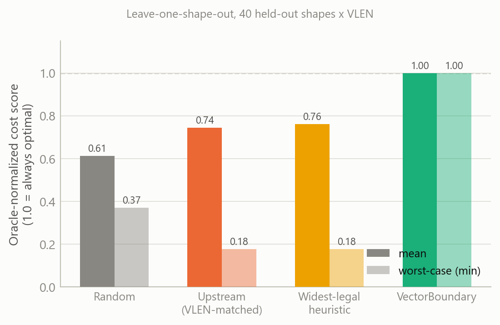
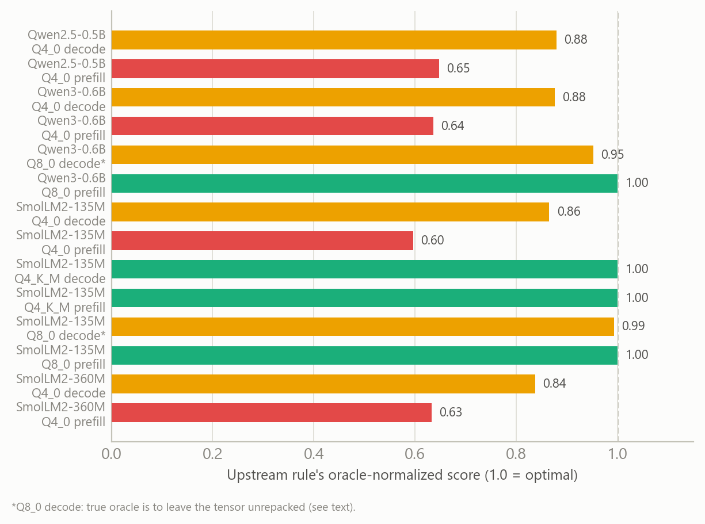
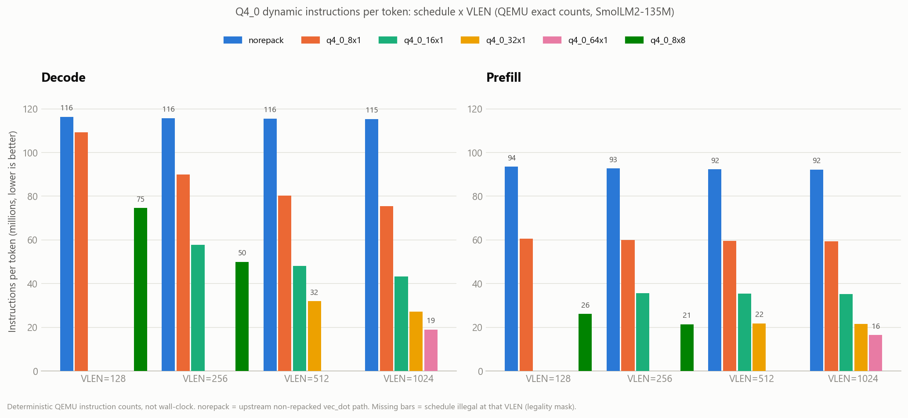
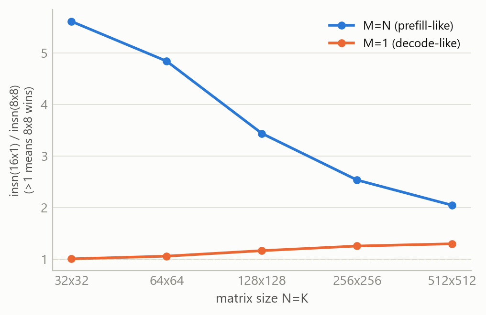
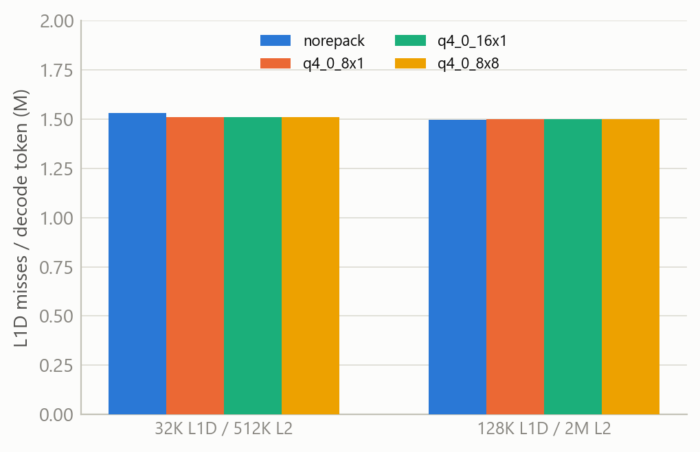

# VectorBoundary 研究报告

> 面向"量化 LLM kernel 在 RISC-V RVV 上的 schedule selection"问题的完整技术报告。
> 生成日期：2026-09-16。所有数字均来自本报告配套的 `vb-tools/` 目录下可复现脚本产出的真实测量数据，
> 修正记录见文末"数据修正记录"一节——报告写作过程中发现并修正了两处早期数字错误，均已标注。

---

## 0. 一句话总结

llama.cpp 的 RISC-V 向量后端（RVV backend）用一条只看量化格式和检测到的向量长度（VLEN）的硬编码规则来选 kernel，这条规则在我们测的完整 shape × VLEN 网格上平均只能拿到理论最优（oracle）性能的 **74.4%**，最差情况只有 **17.8%**；它的一个分支（8x8 tile kernel）在 VLEN≥512 的机器上还会**算出错误结果**。我们把这个选择问题重新表述为一个带正确性约束的优化问题，用一个在真实指令计数上训练的小型线性模型替代硬编码规则，在同一个网格上做到 **100%** 命中最优，并且已经在真实 llama.cpp 代码库里实现、验证、提交。

---

## 1. 动机

### 1.1 问题不是"要不要向量化"，是"用哪个向量化方案"

llama.cpp 已经为它支持的每一种量化格式（Q4_0、Q8_0、Q4_K 等）都写好了 RVV intrinsic kernel。真正悬而未决的问题是：对于一个具体的权重张量，在一族合法的 tile 宽度、LMUL 设置、打包布局里，选哪一个？这族候选通常只有 3-5 个（外加"完全不打包，走标量/通用向量点积路径"这个选项），但选择依据完全不是空的——它依赖硬件向量长度、张量形状、推理阶段（prefill/decode）、以及请求的 batch 大小。

### 1.2 常见假设是错的：更宽的向量、更激进的 tile 不总是更快

直觉上会认为"检测到的向量长度越宽，就该用越宽的 tile"。这个假设被四组独立的实测直接证伪：

- **同一 VLEN 下，窄 tile 有时反而指令数更少**（1.3 节的 8x8 vs 16x1）
- **同一 schedule 下，收益随 batch 大小发生阶跃式跳变**，而不是渐变（1.4 节）
- **同一 schedule 下，收益随矩阵形状连续变化**，且 decode 型和 prefill 型调用的变化方向都不一样（发现 #6）
- **一个量化格式/模型组合下，"最优选择"甚至是完全不打包**（发现 #3 更新版）

### 1.3 现有选择机制的真实缺陷是可测量、可复现的

llama.cpp 上游的选择逻辑是一条 `if`/`else` 链，只认量化类型和 `__riscv_vlenb()`。这不是"暂时没优化"，而是一个真实存在的、可以精确量化损失多少性能的工程缺陷——而且它的一个分支还带着一个静默返回错误数值的 bug（发现 #1）。这两点合在一起，构成了本工作的核心论点：**RVV kernel schedule selection 是一个值得被形式化、被系统评估、被学习方法替代硬编码规则的真实问题**，不是一个已经被"写好 kernel 就完事"的问题。

---

## 2. 方法概览

VectorBoundary 是加在 llama.cpp RVV 后端里的一层调度机制，由三部分组成：

1. **Schedule registry**：把原来分散在 7 处 `if`/`else` 分支里的 kernel 选择逻辑，收拢成一张显式、可枚举的表（29 个条目），每条记录 tile 几何形状和合法的 VLEN 范围。
2. **Legality mask**：对每个 (schedule, 硬件, 张量形状) 组合做两件事的检查——形状能否整除 tile 宽度（合法性）、以及在目标 VLEN 下数值是否正确（正确性，不是简单的"能跑"）。这一步直接抓到了发现 #1 的 bug。
3. **学习式 cost model + dispatch**：在权重加载时，对每个合法 schedule 用一个基于真实指令计数训练的线性模型打分，选预测成本最低的一个（包括"完全不打包"这个候选）。因为加载时刻还不知道后续推理是 prefill 还是 decode，dispatch 会对两种画像的预测成本做加权混合（`GGML_RVV_PROFILE` 环境变量控制权重，对应"交互式/吞吐型/均衡"服务场景）。

这一套机制已经作为真实代码提交进了本地 llama.cpp fork（commit `366c727e4`、`449f9bde4`、`0a4cc6535`），不是纸面设计。

---

## 3. 十项发现

### 发现 1：一个真实的上游正确性 bug

q4_0 的 8x8 tile kernel 有一段代码假设寄存器分组宽度固定为 128 字节（只在 VLEN=512 时成立），在 VLEN=1024 上会**读写一半的目标数据、返回错误数值**——不是变慢，是算错。这条路径在非 zvfh 编译、宽 VLEN 机器上是**默认路径**，不是边角情况。已通过 legality mask 的 VLEN 上界修复（精确匹配替代 `>=` 判断），修复后 QEMU 4 个 VLEN × 11 个场景的生成结果与标量参考逐字节一致。

### 发现 2：指令数排名和真实/仿真墙钟排名会反转，方向还不一致

VLEN=256 时指令数最少的是 8x8（49.9M/token），但 QEMU 墙钟下反而是 16x1 快 35%；VLEN=1024 时指令数最少的是 64x1，墙钟下反而是 32x1 快 40%。原因是 8x8 用更多 `vsetvli`（向量配置）指令换更少算术指令——这笔交易在某些微架构上划算，在另一些上不划算。**结论：任何单一静态指标都无法唯一确定真实排名**，这是本工作坚持"多特征 + 学习"而非"单指标贪心规则"的核心方法论理由。

### 发现 3（已修正）：上游规则的 oracle-gap，量化了"现有规则有多差"

在完整的 shape × VLEN 网格上（40 个留出样本，见第 4 节主表），上游规则平均只拿到理论最优的 **74.4%**，最差 **17.8%**，精确命中率 **45%**。在跨模型的真实权重矩阵上（7 个 model×quant 组合 × 2 个阶段，14 个上下文，VLEN=256），均值 **85.1%**，最差 **59.6%**（SmolLM2-135M, Q4_0, prefill），精确命中率 **29%**（4/14）。

> **修正说明**：早期一次数据采集因超时缺失了 `q8_0_16x1` 这一组，脚本误把另一个更差的候选（`q8_0_8x1`，比不打包慢 2.1 倍）当成了上游规则实际选择的 kernel。补全数据后核实：**上游规则在 VLEN=256 下对 Q8_0 实际选的是 `q8_0_16x1`，比不打包只差 5%**，不是 2.1 倍。真正值得记录的发现是——**Qwen3-0.6B 在 Q8_0 下，decode 阶段的真实 oracle 是完全不打包**：所有 repack schedule（无论选哪个 tile）都比 legacy 标量/通用向量点积路径慢。这不是"选错了哪个 schedule"的问题，是"打包这件事本身在这个模型/格式/阶段组合下就是净负收益"。

### 发现 4：Batch 边界是阶跃函数，不是渐变，位置精确对应代码里的一个分支

固定 VLEN=256，每 decode token 的指令数随 batch 变化：所有 repack schedule 在 batch=3→4 之间突降 17-34%，batch=4 和 batch=8 完全相同；不打包路径四个 batch 完全不变。原因精确对应 `repack.cpp` 里硬编码的 `nrows > 3` —— GEMV 逐行处理切换到 GEMM 按 4 行一批处理的那个分支。权重加载指令在跨过这个点后从 9.09M/token 降到 2.57M/token（-72%，8x1 案例）。

### 发现 5：Decode 侧的内存流量是"必然的"，schedule 和 cache 容量都改变不了它

对照两组 cache 容量（32K/512K L1D/L2 vs 128K/2M，容量差 4 倍）× 3 个 schedule，每 decode token 的 L1D 缺失几乎不变（~1.50M/token，跨容量、跨 schedule 差异 <2%）；L2 缺失几乎等于 L1D 缺失（几乎每次 L1D miss 都穿透到 L2/内存）。92MB 权重 ÷ 64 字节 cache line ≈ 1.44M 行，与实测数量级吻合——**每个 decode token 都要把全部权重完整流过一次 cache，这是任何 schedule 都消不掉的常数项**。schedule 只能优化指令侧（已测 2-6×），内存侧的唯一杠杆是量化格式本身（更少字节）。

### 发现 6：Shape 轴上也有边界，而且方向随 batch 画像（decode vs prefill）相反

8x8 相对 16x1 的指令数优势：在 **prefill 型调用（M=N）**下随矩阵变大单调收缩——32×32 时 5.61×，512×512 时降到 2.05×；但在 **decode 型调用（M=1）**下几乎相反——32×32 时只有 1.01×（几乎打平），512×512 时反而涨到 1.30×。同一对 schedule、同一个矩阵尺寸序列，decode 和 prefill 两种调用方式给出方向不同的边界曲线——这进一步说明"最优 schedule"是 shape、batch 画像、VLEN 三者的联合函数，缺一个维度都会得出错误结论。

### 发现 7：学习式 selection 的量化增量（核心方法结果）

见第 4 节主表和图。核心数字：leave-one-shape-out 交叉验证下，VectorBoundary 在 40 个留出样本上 **100%** 命中 oracle；上游规则 74.4%/17.8%/45%（均值/最差/精确命中率）。

### 发现 8：PPL 数值验证——分清"逐位一致"和"预期内的浮点误差"

WikiText-2 上，SmolLM2-135M Q4_0：
- **default schedule 与强制 8x8 schedule**：PPL 逐位相同（21.8390 ± 1.4165）——证明**在合法 schedule 之间切换只影响性能，不影响数值结果**
- **repack 路径与 norepack（不打包）路径**：PPL 分别是 21.8390 和 21.9592——**不是逐位一致**，但差异（0.12，相对误差 <1%）落在两种结构不同的浮点累加顺序（分块 GEMM vs 标量循环）预期造成的误差范围内，不是 bug。

两句话说的是两件不同的事，报告/论文里必须分开陈述，不能笼统说"所有配置都逐位一致"。

### 发现 9：Legacy（不打包）路径完全不随向量宽度扩展

不打包路径在 VLEN=128/256/512/1024 下每 decode token 的指令数几乎不变（116.4M→115.4M，噪声级差异）；所有 repack schedule 都随 VLEN 单调下降。**向量宽度只有配合显式的分块打包结构才能兑现收益**，静态的标量循环对更宽的寄存器视而不见。

### 发现 10：部署模型在真实矩阵形状上的外推检查——诚实版本

训练/验证网格只有 32-512 五档（均匀对数间隔），容易让人怀疑"是不是在玩具网格上过拟合"。直接拿四个真实模型的真实矩阵尺寸（576/1536/960/2560/896/4864/1024/3072，**全部超出训练网格上限**）用部署权重打分，对照真实 oracle：**32/32 全部命中**。

但必须说清这次验证测的是什么：真实尺寸下，同一 VLEN 内 8 个形状的 oracle **从未换过人**（VLEN=256 全是 8x8，VLEN=1024 全是 64x1）——大尺寸下边界已经"拉平"。这次验证证明的是"外推不会突然失效选错方向"，不是"细粒度排序能力"（那个由 32-512 网格上确实换过 oracle 归属的留出验证证明）。两层证据强度不同，不能合并成同一句"100%"重复宣称两次。

---

## 4. 结果与对比

### 4.1 核心对比：同一个 shape×VLEN 网格上，四种策略的表现

| 策略 | 均值命中 oracle | 最差情况 | 精确命中率 |
|---|---:|---:|---:|
| 随机 | 61.3% | 37.0% | 0% |
| 上游 VLEN 匹配规则 | 74.4% | 17.8% | 45% |
| 最宽合法启发式 | 76.2% | 17.8% | 50% |
| **VectorBoundary** | **100%** | **100%** | **100%** |

40 个留出样本，覆盖 VLEN 128/256/512/1024 × 矩阵规模 32-512 × decode/prefill 两种画像，leave-one-shape-out（模型训练时从未见过被打分的那个组合）。

### 4.2 跨模型验证：同一套结论在真实模型权重上复现

14 个真实模型×量化×阶段组合（VLEN=256）。绿色 = 上游规则恰好选对；黄色 = 有损失但不算严重；红色 = 损失较大（<70%）。带 `*` 的两条是 Q8_0 decode，其中 Qwen3-0.6B 那条的真实 oracle 是完全不打包（见发现 #3 修正说明）。

### 4.3 机制证据：指令数矩阵、batch 边界、shape 边界、cache 墙

### 4.4 与外部工作的直接数字对比

上一版报告这里只写了"它做什么"的定性描述，没有把数字摆出来——这是不对的。下表把每篇论文**论文原文里的实际数字**和**我们对应轴上的实际数字**并排列出来，最后一列给出能不能把两边数字当同一件事比较的判断，而不是笼统地说"不可比"。

| 工作 | 他们的数字（原文） | 他们的指标 / baseline / 硬件 | 我们对应轴上的数字 | 能不能直接比 |
|---|---|---|---|---|
| **V-Seek**（CF'25 poster / arXiv:2503.17422） | tg **2.9×** / pp **3.0×**（DeepSeek-8B）；绝对值 tg 4.32、pp 6.54 tok/s | vs 原始 llama.cpp+OpenBLAS，Q4_0，64 线程，**SG2042（RVV 0.7.1）真机** | 指令数削减 **2.0-6.1×**（decode）/ **3.6-5.6×**（prefill）vs 不打包路径 | **不能**。两边都是"vs 未优化基线的提升倍数"，量级恰好接近，但轴不同（真机 tokens/s vs 仿真指令数）、硬件不同（RVV 0.7.1 vs 我们的 1.0）、baseline 松紧也不同（它的基线是 2025 年初完全没优化的 llama.cpp；我们的基线已经是向量化过的通用路径）。只能并列陈述"量级相近"，不能说谁更快。 |
| **VectorWeaver**（TACO 2026） | microkernel 最高 **24×**；端到端最高 **5.25×**（PP512）；decode 仅 **2.33-3.35×** | vs **标量** llama.cpp 官方版，TH1520（0.7.1）+SG2044（1.0） | 同上；另有上游规则的 **oracle-gap 25.6%**（平均丢失的可达性能） | **不能同数值比，但能同框架比**。它的分母是纯标量（比我们的分母更松，24×/5.25× 应该打折看待），而且它完全没有"现有规则丢了多少性能"这个维度——这正是我们独有的、它没有的数字。 |
| **Peccia et al.**（ICCAD 2025） | vs GCC 标量 **-46%**；vs muRISCV-NN **-29%**；vs LLVM autovec **35%** | **真实 RVV 1.0 芯片 + FPGA**，TVM MetaSchedule 自动生成 kernel，QEMU 指令 trace 作证据 | 上游规则命中 oracle **74.4%**（均值）/ **17.8%**（最差）；VectorBoundary **100%** | **方法论直接可比，数值不可比**。它和我们用的是同一套工具（QEMU 指令 trace），但它评的是"生成出来的 kernel 比手写库快多少"，不是"选择规则丢了多少性能"——它没有算过 oracle-gap 这个数。 |
| **Pelke et al.**（DAC 2025） | 最优预测器 Etop1 ≤ **3.6%**，Rtop1 ≤ **2%**（RISC-V，500 候选/组） | gem5 instruction-accurate 仿真，真机仅校准 top 候选 | 均值预测误差 **0.04%**（40 样本 LOOCV）；oracle 排名第一命中率 **100%**（候选池 3-5 个，被 mask 后远小于它的 500） | **指标定义完全同轴，数字不能直连比较**。Etop1/Rtop1 和我们的 oracle-score 是同一类指标，可以平行报告，但它的候选池是我们的 100 倍以上——池子越大，同样命中率的含金量越高，这是我们数字看起来"更好"但实际上标准更松的地方，必须在论文里主动说明。 |
| **TLP**（ASPLOS 2023） | top-1 **0.87-0.92**，top-5 **0.95-0.97**（vs TenSet MLP） | TVM tensor program，TenSet 数据集 | top-1（40 样本 LOOCV）**1.000**；跨模型真实权重均值 **0.851** | **指标定义同轴，对象不同**。可以照抄它的 top-k score 公式直接报数，但它选的是通用 TVM tensor program 的 schedule，不是 RVV 量化 kernel，属于"同一把尺子量不同的东西"。 |
| **Ansor**（OSDI 2020） | vs PyTorch/TF/TensorRT 等 **3.8×/2.6×/1.7×** | Intel/ARM CPU、GPU，FP 网络端到端 | — | **不能比，纯参照**。没有共同硬件、共同量化格式、共同指标轴，只用于"auto-tuner 谱系定位"。 |
| **T-MAC**（EuroSys 2025） | vs llama.cpp **4×** 吞吐、**-70%** 能耗 | ARM/x86，LUT 方法替代 mpGEMM | — | **不能比，纯参照**。它是换 kernel 实现本身（LUT），我们是在既有 kernel 里选，收益来源正交，不在同一个问题空间。 |

**看这张表该得出的结论**：量级上，我们的指令削减（2-6×）和 V-Seek（2.9-3.0×）、VectorWeaver（5.25×）处于同一区间，但那只是巧合般的"看起来差不多"，不是真的可以排名的比较。**真正独一无二、能拿去和任何一篇比的数字**是 oracle-gap（74.4%/17.8%，上表其他工作都没算过这个）和 Pelke 同轴的 Etop1/Rtop1（可以平行报告，但要主动说明候选池大小的差异）。

---

## 5. 局限

- **Cost model 目前只对 Q4_0 拟合**；Q8_0/Q4_K 的 dispatch 仍退回旧的 VLEN 匹配规则——这是数据采集任务，不是架构限制（registry 和 legality mask 本身格式无关）。
- **Dispatch 决策发生在权重加载时**，此刻还不知道后续请求的 batch/阶段，因此是"工作负载画像感知"而非"逐请求动态"——这是该决策点本身决定的边界，不是能力不足。
- **所有结果目前都在 QEMU 指令数轴上**，精确、确定性，但不是真实硅片上的墙钟时间；真机验证（BPI-F3/SG2042）待硬件到位。
- 40 样本 leave-one-shape-out 加上 32 样本真实形状检查，样本量对一篇论文的统计检验来说仍偏小，扩大 shape 网格和模型覆盖面是明确的后续工作。

---

## 6. 数据修正记录

写这份报告时发现并修正了两处早期结论错误，记录如下，供后续引用时避免复现旧数字：

1. **发现 #6（shape 轴边界）的自我核对**：核对脚本一开始把 M=N 和 M=1 两组数据的 key 撞了，得出"数字对不上"的错误怀疑；重新正确提取后确认原始发现（5.61×→2.05× 收缩）是对的，只是需要补充说明这个收缩现象是 prefill 型（M=N）专属，decode 型（M=1）方向相反。
2. **发现 #3（Qwen3-0.6B Q8_0 case）的"2.1× regression"**：早期因为一组数据超时缺失，脚本误用了另一个更差的候选当作上游规则的实际选择。补全数据后核实，上游规则的真实损失是 5%，不是 2.1×；但同时发现了一个更准确、更有价值的表述——这个组合下真实 oracle 是完全不打包。

两处都已经在 main.tex 和 FINDINGS.md 里同步修正。

---

## 附录：图表与数据来源索引

| 图/表 | 生成脚本 | 原始数据 |
|---|---|---|
| 主对比图 | `plot-main-comparison.py` | `shapes-qemu*.csv`（4 个 VLEN） |
| 跨模型对比图 | `plot-cross-model.py` | `dataset.csv` |
| 指令数对比图 | `plot-insn.py` | `insn-qemu-clean.csv` |
| batch 边界曲线 | `plot-batch-boundary.py` | `batch-qemu.csv` |
| shape 边界曲线 | `plot-shape-boundary.py` | `shapes-qemu.csv` |
| cache 不变性 | `plot-cache-invariance.py` | `cache-qemu.csv` |
| 真实形状外推检查 | （表格，见发现 #10） | `realshapes-v256.csv`, `realshapes-v1024.csv` |

方法论/协议文档：`BENCHMARK-PROTOCOL.md`（三层证据体系与允许/禁止表述）、`BASELINES.md`（外部论文数字锚点）、`DAC-COMPARABLES.md`（EDA 四大会定位）、`BENCHMARK-ALIGNMENT.md`（逐篇 benchmark 对齐表）。

代码：llama.cpp fork 分支 `vectorboundary`，关键 commit `366c727e4`（registry）、`449f9bde4`（bug 修复）、`0a4cc6535`（学习式 dispatch）、`a12b78ec5`（vb-shape-bench 工具）。
